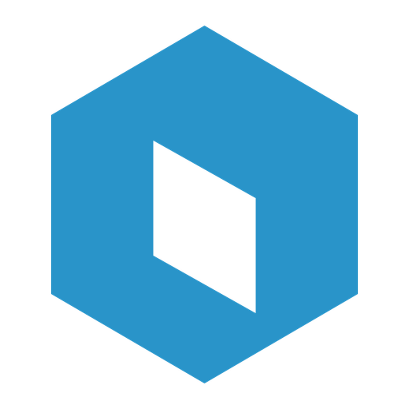

<p align="center">
  
</p>
<h1 align="center">Voxel</h1>
<p align="center">
  <strong>The open-source Roblox desktop client</strong>
</p>
<p align="center">
  A third-party launcher with multi-account management, server browsing,
  avatar editing, and more.
</p>

<p align="center">
  <a href="https://github.com/6E6B/voxel/releases">
    
  </a>
  
  <a href="LICENSE">
    
  </a>
  
</p>

<p align="center">
  
  
  
  
</p>

<!-- TODO: Add a screenshot or GIF here -->
<!--  -->

---

## Table of Contents

- [Features](#features)
- [Installation](#installation)
- [Build from Source](#build-from-source)
- [Security](#security)
- [Roadmap](#roadmap)
- [Contributing](#contributing)
- [Disclaimer](#disclaimer)
- [License](#license)

---

## Features

Voxel aims to achieve full feature parity with the Roblox website and desktop app over time.

Have a feature in mind? [Open an issue](https://github.com/6E6B/voxel/issues) or request it in the [Discord server](https://discord.gg/your-invite-here).

---

## Installation

Download the latest binary from [Releases](https://github.com/6E6B/voxel/releases).

| Platform    | Filename                 |
| :---------- | :----------------------- |
| **Windows** | `voxel-x.x.x-setup.exe` |
| macOS       | *(planned)*              |
| Linux       | *(planned)*              |

---

## Build from Source

**Prerequisites:** Node.js v18+ and npm or pnpm.
```bash
# Clone
git clone https://github.com/6E6B/voxel.git
cd voxel

# Install dependencies
npm install

# Start in development mode
npm run dev

# Build for Windows
npm run build:win
```

---

## Security

Voxel never transmits your credentials to any external server.

- All credentials are stored **locally** and encrypted with Electron's `safeStorage` (OS-level credential storage).
- An optional additional **AES-256-GCM** encryption layer can be enabled via a PIN you set.

→ [View the StorageService implementation](https://github.com/6E6B/voxel/blob/main/src/main/modules/system/StorageService.ts)

---

## Roadmap

- [ ] macOS support
- [ ] Linux support
- [ ] Plugin/extension system

Have a feature request? [Open an issue](https://github.com/6E6B/voxel/issues).

---

## Contributing

Contributions are welcome! To keep things smooth:

1. **Open an issue first** to discuss significant changes before writing code.
2. Keep PRs focused — one feature or fix per PR.
3. Follow the existing code style (TypeScript strict mode, Tailwind for styles).

---

## Disclaimer

Voxel is an independent, community-built project. It is not affiliated with, endorsed by, or sponsored by Roblox Corporation. Use at your own discretion.

---

## License

[GPL-3.0](LICENSE)